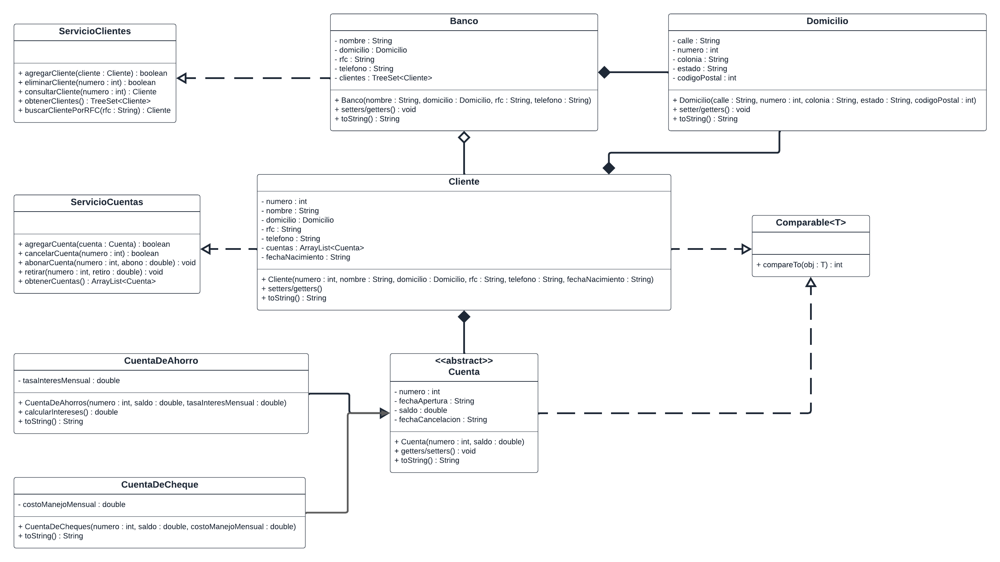

> Para reforzar la teoría vista hasta el momento durante el curso, realizaremos una serie de ejercicios que buscan que utilicemos los conocimientos aprendidos sobre un proyecto Java.

## Objetivos ##

> Reforzar conceptos de POO para diseñar un sistema que vaya creciendo implementando los temas teóricos del curso.

### Planteamiento inicial: ###

> Nos piden elaborar un proyecto de "sistema bancario" que permita mostrar a grandes rasgos el funcionamiento de un banco para ellos nos piden recrear el diagrama de clases siguiente.

Implementar el diagrama en un proyecto de Java llamado BancaElectronica.

El cual se compone de los siguientes componentes:

* Clase Banco:
    * Atributos:
        * nombre : String
        * domicilio : Domicilio
        * rfc : String
        * telefono : String
        * clientes : TreeSet < Cliente >
    * Métodos:
        * Banco(nombre, domicilio, rfc, telefono)
        * setters y getters
        * toString()

* Clase Cliente:
    * Atributos:
        * numero : int
        * nombre : String
        * domicilio : Domicilio
        * rfc : String
        * telefono : String
        * cuentas : ArrayList < Cuenta >
        * fechaNacimiento : String
    * Métodos:
        * Cliente (nombre, domicilio, rfc, telefono, fechaNacimiento)
        * Getters y Setters
        * toString() : String

* Clase Cuenta:
    * Atributos:
        * numero : int
        * fechaApertura : String
        * saldo : double
        * fechaCancelacion : String
    * Métodos:
        * Cuenta(numero, saldo)
        * Getters y Setters
        * toString() : String

* Clase CuentaDeAhorro:
    * Atributos:
        * tasaInteresMensual : double
    * Métodos:
        * CuentaDeAhorro(numero, saldo, tasaInteresMensual)
        * calcularIntereses : double
        * toString() : String

* Clase CuentaDeCheque:
    * Atributos:
        * costoManejoMensual : double
    * Métodos:
        * CuentaDeCheque(numero, saldo, costoManejoMensual)
        * toString() : String

* Clase Domicilio:
    * Atributos:
        * calle : String
        * numero : int
        * colonia : String
        * estado : String
        * codigoPostal : int
    * Métodos:
        * Domicilio (calle, numero, colonia, estado, codigoPostal)
        * Getters y Setters

* Interfaz ServicioClientes:
    * Métodos:
        * agregarCliente (cliente) : boolean
        * eliminarCliente(numero) : boolean
        * consultarCliente (numero) : Cliente
        * ObtenerClientes() : TreeSet < Cliente >
        * buscaClientePorRFC (rfc) : Cliente

* Interfaz ServicioCuentas:
    * Métodos:
        * agregarCuenta (cuenta) : boolean
        * cancelarCuenta(numero) : boolean
        * abonar (numero, abono) : void
        * retirar(numero, retiro) : void
        * obtenerCuentas
        ArrayList < Cuenta >
        
Considera por lo menos las siguientes validaciones:
* Para los campos de texto, validar que las cadenas no sean solamente espacios en blanco y que no estén vacías. 
* Para los números telefónicos la longitud del número debe ser de 10 dígitos.
* Al buscar una cuenta o cliente que no existe, se debe lanzar una excepción personalizada que indique que no se encontró a la cuenta o al cliente.
* Por lo menos al interior de un Cliente, no se pueden registrar cuentas con el mismo numero de cuenta, de intentarlo se debe mandar una excepción indicando el error.
* Al intentar hacer un retiro, en caso de que el monto sea mayor al saldo que tiene la cuenta, debe mandar una excepción de saldo insuficiente.

En caso que consideres que pueda requerirse mas validaciones, eres libre de implementarlas.

Validar que las clases funcionen correctamente creando cuatro cuentas para dos clientes (dos a cada uno) y agregar los clientes dentro de un objeto de tipo Banco.

Por ultimo, realizaremos algunos cambios en nuestro proyecto. Y le agregaremos la funcionalidad de ordenamiento a nuestros objetos.

Implementa la interfaz Comparable en las clases Cliente y Cuenta.

En la clase Cliente implementar el ordenamiento por numero

En la clase Cuenta implementar el ordenamiento por saldo

--------------------------------------------------

Dentro de otra clase con un método main copia el siguiente código y realiza unas modificaciones sobre el mismo.

List< String >arrayList = new ArrayList<>();
List< String > linkedList = new LinkedList<>();
long inicio = 0;
for(int i = 0; i < 1_000_000; i++){
    arrayList.add(new String("Cadena numero: " + i));
    linkedList.add(new String("Cadena numero: " + i));
}
System.out.println("Tiempo invertido en insertar una cadena usando ArrayList");
antes = System.nanoTime();
#Linea 1
arrayList.add(INDICE, new String("Otra cadena por agregar"));
System.out.println(System.nanoTime() - inicio);
System.out.println("Tiempo invertido en insertar una cadena usando LinkedList");
antes = System.nanoTime();
#Linea 2
linkedList.add(INDICE, new String("Otra cadena por agregar"));
System.out.println(System.nanoTime() - inicio);

Reemplaza INDICE por algún valor numérico donde 0 <= INDICE <= 1_000_000

Ejecuta el programa y observa cuanto tiempo tarda en agregarse un elemento a estas colecciones usando distintas implementaciones.

¿Cuál de las colecciones puedes identificar que es más eficiente para temas de escritura? ¿La velocidad cambia conforme cambia el valor de INDICE?

Cambia la Linea 1 y Linea 2 por un método para remover un elemento, ¿Los resultados son los mismos que obtuviste al insertar nuevos elementos? Repite el procedimiento, pero cambiando el valor de INDICE

Cambia la Linea 1 y Linea 2 por un método para recuperar un elemento, ¿Qué puede observar de los tiempos de respuesta? Repite el procedimiento, pero cambiando el valor de INDICE

En tu opinión, ¿Que colección usarías para operaciones solamente de lectura?, ¿Cuál usarías para operaciones de escritura?, ¿Depende la posición del elemento a ser utilizado la elección del tipo de colección?