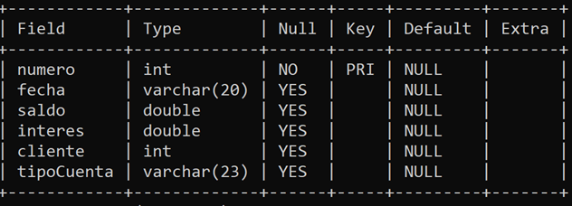
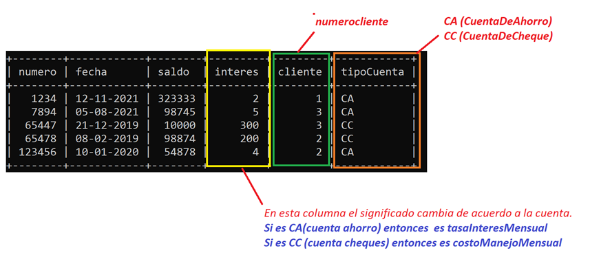

> Para reforzar la teoría vista hasta el momento haremos unos cambios al proyecto de banca electronica para hacer uso de la API de BD de Java.

## Objetivos ##

> Reforzar funcionalidad de los métodos de la API de BD que ofrece Java.

### Planteamiento inicial: ###

> Para la práctica de esta lección cambiaremos el archivo por una base de datos. Usaremos los siguientes comandos para crear una base de datos con los datos que tenía el archivo

SQL
drop database if exists cap10;
create database cap10;
use cap10;
create table cuentas(numero int(10) primary key, fecha varchar(20), saldo double, interes double, cliente int(3), tipoCuenta varchar(23));
insert into cuentas values(1234 , '12-11-2021', 323333, 2 , 1, "CA");
insert into cuentas values(123456, '10-01-2020', 54878 , 4 , 2, "CA");
insert into cuentas values(7894 , '05-08-2021', 98745 , 5 , 3, "CA");
insert into cuentas values(65478 , '08-02-2019', 98874 , 200,2, "CC");
insert into cuentas values(65447 , '21-12-2019', 10000 , 300,3, "CC");

> Con estos comandos crearemos una base de datos llamada cap10. Y dentro de ella agregaremos una tabla llamada cuentas.

La estructura de la tabla es la siguiente:

Crear 3 clientes en la clase principal: Uno con el número 1, otro con el 2 y el último con el 3.

Cambiar la extracción de las cuentas del archivo por extraer las cuentas de la base de datos.

Usar Connection, Statement, ResultSet para la consulta de los datos.

Asignar las cuentas a sus clientes.

Validar que los métodos sigan funcionando.