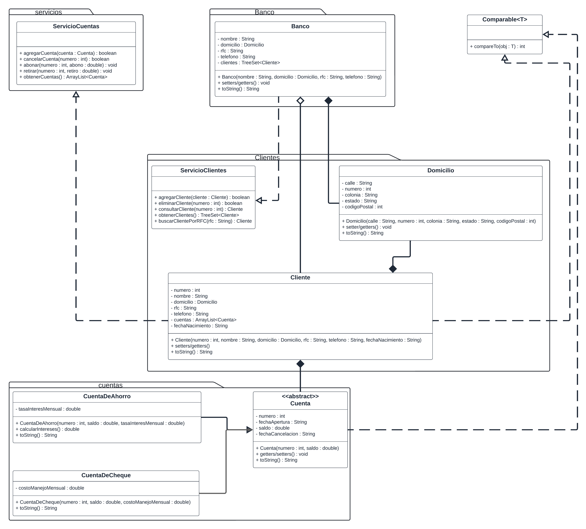

> Para reforzar la teoría vista hasta el momento haremos un nuevo proyecto llamado Banca electronica modular por lo que iremos copiando el codigo que ya tenemos desarrollado de nuestro proyecto original a la nueva forma de trabajar con modulos.

## Objetivos ##

> Reforzar funcionalidad de los módulos de Java.

### Planteamiento inicial: ###

> Nos han solicitado probar que tano podria afectar el cambio de java de forma tradicional a el enfoque modular, por lo que iremos haciendo este tipo de migraciones.

Generar un nuevo proyecto y especificar que será un proyecto modular, cambiar la aplicación de Java que hemos desarrollado a una aplicación modular conforme lo indicado por el siguiente diagrama.

Validar que todas las clases se puedan comunicar entre si a pesar de que se encuentren en diferentes módulos.

Validar que la aplicación siga funcionando.